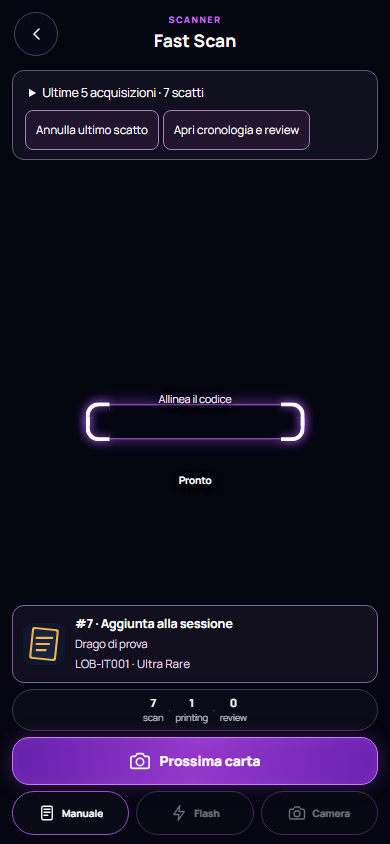
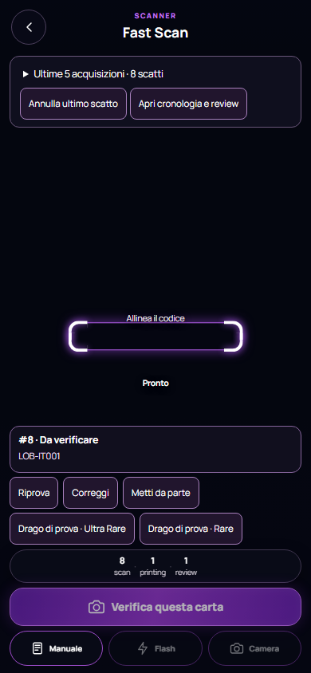
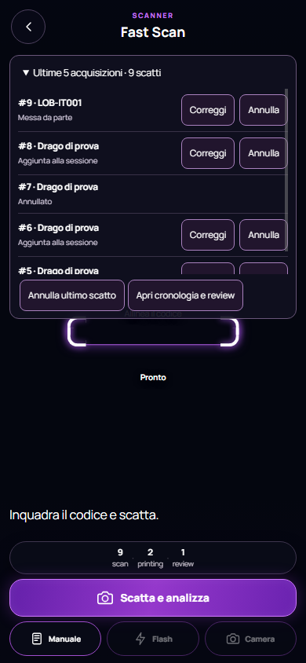
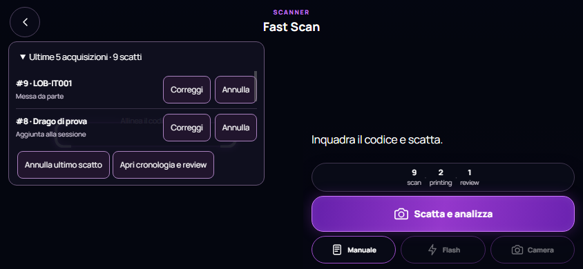

# Fast Scan — implementazione e verifica locale, 17 settembre 2026

## Risultato

Implementati ciclo camera con cancellazione e timeout, registro persistente per acquisizione, quantità derivate dagli eventi, protezione delle risposte tardive e modalità assistita. Nessun commit, deploy o scrittura a servizi esterni. I test usano mock; la verifica browser usa Chrome headless con pagina locale isolata, API simulate e URL HTTPS bloccati.

Il primo OCR rapido, la soglia STRONG_OCR_CONFIDENCE=88, i due passaggi, il matching esatto/near/fuzzy, la cache e la sincronizzazione a chunk sono conservati. Nessuna modifica al motore OCR, al catalog cache o al protocollo della sync. La nuova cronologia contiene metadati e URL delle immagini di catalogo, non fotografie o pixel dello scatto.

## File modificati e aggiunti

| File | Modifica |
| --- | --- |
| `js/fast-scan-camera.js` | Budget di startup, inventario opzionale, fallback singolo, generation, cleanup, progresso video e protezione focus tardivo. |
| `js/fast-scan-core.js` | Registro scanEvents, migrazione, proiezioni entries/review, annullamento/correzione/versioni. |
| `js/fast-scan-storage.js` | Snapshot copiato al momento della richiesta, scritture/clear serializzati, chiusura connessioni e fallback locale. |
| `js/fast-scan.js` | Recovery protetto, acquisizioni/fallimenti registrati, matching legato a ID/versione, modalità assistita, storico, correzione e label auto-add. |
| `styles.css` | Risultato compatto, azioni assistite, cronologia e disposizione mobile/orizzontale. |
| `scripts/fast-scan-camera-audit.mjs` | Convertito lo script diagnostico precedente in suite di regressione: verifica la correzione, non più la presenza dei bug. |
| `scripts/fast-scan-events-smoke.mjs` | Nuove regressioni su eventi, quantità, versioni, ripristino, gating e persistenza. |
| `scripts/fast-scan-assisted-browser-smoke.mjs` | Nuova verifica UI su Chrome locale, con server e profilo temporanei. |
| `scripts/fast-scan-milestone-smoke.mjs` | Mock video con dimensioni valide; attesa del cleanup tardivo; adeguamento alle quantità derivate e al nuovo trattamento dei miss. |
| `scripts/fast-scan-ocr-pipeline-smoke.mjs` | Nuovi messaggi assistiti e asserzioni sugli eventi OCR falliti; conservate le verifiche su OCR/matching. |
| `docs/fast-scan-fixes-2026-09-17.md` | Questo report. |
| `docs/fast-scan-verification/01-confirmed-mobile.png` | Risultato confermato e pulsante Prossima carta. |
| `docs/fast-scan-verification/02-review-required-mobile.png` | Carta ambigua, azioni e scelta della rarità. |
| `docs/fast-scan-verification/03-history-mobile.png` | Ultime acquisizioni, inclusi annullamenti e rinvii. |
| `docs/fast-scan-verification/04-landscape.png` | Vista orizzontale. |

Il precedente audit `docs/ocr-camera-audit-2026-09-17.md`, `.claude/` e `package-lock.json` erano già non tracciati all'inizio del lavoro e non sono stati modificati in questo intervento.

## Correzioni effettive

- Lo startup ha un budget condiviso per getUserMedia, play, disponibilità delle dimensioni video e configurazione. L'inventario dispositivi è best-effort con limite massimo di 1,5 secondi e comunque entro il budget residuo.
- stop invalida immediatamente la richiesta. Gli stream restituiti in ritardo vengono chiusi; ogni continuazione verifica la generation. Il cleanup di una richiesta vecchia non ferma la nuova.
- Errori di play o di lettura delle impostazioni non lasciano track acquisite vive. Anche la diagnostica di stop può fallire senza impedire il rilascio.
- Un device exact non più disponibile causa un solo tentativo environment. Non c'è un ciclo di retry del fallback.
- Il watchdog osserva currentTime nel controllo di salute esistente: oltre quattro secondi senza progresso segnala preview congelata. Non sono stati aggiunti loop per-frame; il ripristino da background azzera il riferimento temporale.
- Recovery e startup del controller verificano requestId, fase, sessione e sospensione. Un risultato tardivo non imposta scanning dopo review/uscita/sospensione.
- Ogni richiesta di acquisizione accettata crea un evento, persistito prima della cattura/OCR. I click su controlli occupati/disabilitati non sono nuove acquisizioni. Errori, assenza di testo e interruzioni conservano un evento e un motivo.
- Annullamento, correzione, rinvio e ripristino invalidano la resolutionVersion. Risoluzioni OCR remote, percorso consensus precedente, inserimenti manuali e correzioni verificano la sessione e la versione prima di applicare l'esito.
- Le quantità vengono ricostruite dagli eventi CONFIRMED. Annullare una copia lascia le altre; correggere A in B sposta solo quella copia.
- La modalità assistita impedisce di avanzare implicitamente da PENDING_REMOTE o REVIEW_REQUIRED. Su un riconoscimento confermato mostra carta/codice/rarità/numero e usa Prossima carta per il successivo scatto. Su dubbi espone Riprova, Correggi e Metti da parte.
- Metti da parte conserva l'evento e invalida il risultato remoto pendente. Nessuna aggiunta automatica tardiva di una carta rinviata. La coda mantiene concorrenza 1 e il percorso di acquisizione limita a 3 le verifiche pendenti, con indicazione visibile.
- Storico delle ultime 5 acquisizioni nel live, storico completo nella review, correzione per ID, annullamento singolo e Annulla ultimo scatto. Una correzione aperta dalla review resta nella review.
- Auto-add è rinominato in «Accetta automaticamente corrispondenze molto simili», con spiegazione delle corrispondenze esatte e dubbie. La politica di matching resta invariata.
- Il salvataggio segnala il numero degli scatti irrisolti esclusi; elaborazioni/verifiche attive bloccano il salvataggio. La sincronizzazione parziale continua a impedire modifiche alla sessione.

## Compatibilità e migrazione

Lo snapshot versione 2 include scanEvents e mantiene entries, review, total, scanned e settings per i consumatori esistenti. entries e review sono proiezioni: scrivere direttamente `entries.get(...).quantity` non modifica la fonte primaria; si deve usare `updateQuantity`. I caller applicativi erano già compatibili; un vecchio test che mutava direttamente la Map è stato aggiornato a usare il metodo pubblico.

Gli snapshot legacy vengono migrati in memoria: una voce per copia, conservazione degli ID della review, metadati di edizione/condizione e contatore storico. Se il contatore legacy supera le voci disponibili, eventi marcati LEGACY_HISTORY_UNAVAILABLE conservano il conteggio senza inventare carte. La fonte legacy rende distinguibile l'importazione. L'ordine fisico e gli orari originali non sono ricostruibili dal vecchio aggregato.

Le modifiche manuali della quantità sono eventi di aggiustamento che contribuiscono al totale, ma non incrementano il contatore degli scatti né occupano un numero di acquisizione. Edizione e condizione della copia vengono mantenute durante una correzione.

Al ripristino, CAPTURED/PROCESSING/PENDING_REMOTE diventano voci da verificare con versione incrementata e messaggio di interruzione. DEFERRED e FAILED rimangono distinguibili. Il piano sync e gli ACK dei chunk sono conservati; la logica della sync non è stata riscritta.

## Test eseguiti

Esecuzione con Node 22.13.0 locale; tutti exit code 0.

| Script / controllo | Esito |
| --- | --- |
| `fast-scan-camera-audit.mjs` | PASS — timeout play/metadata, stop tardivo, cleanup anche su settings falliti, inventory errore/timeout/assenza, fallback singolo, ownership, freeze, recovery superato. |
| `fast-scan-events-smoke.mjs` | PASS — duplicati, undo singolo, correzione A→B, versioni, cancel/correct/defer prima della risposta, restore/legacy, fallimenti, gating, lock sync e ordine save/clear. |
| `fast-scan-ocr-pipeline-smoke.mjs` | PASS — primo passaggio, copie, ambiguità, letture deboli/discordanti, eventi falliti, lookup persistito, timeout worker e cache atomica. |
| `fast-scan-ocr-confusions-smoke.mjs` | PASS — candidati J/H, review e budget dei lookup. |
| `fast-scan-p0-smoke.mjs` | PASS — 200 scan, 36 printing, 2 chunk, retry/risposta persa/concorrenza/rollback simulati. |
| `fast-scan-milestone-smoke.mjs` | PASS — camera, crop/preprocessing, matching, buffer 100/500/1000, batch e PWA. |
| `fast-scan-telemetry-smoke.mjs` | PASS — contatori worker, finestra e export telemetria, cache e campi debug. |
| `fast-scan-assisted-browser-smoke.mjs` | PASS — 390×844 e 844×390, pulsanti, 5 recenti, undo, rarità, pending/defer, review completa e correzione nella review. Nessuna eccezione JS o overflow orizzontale. |
| `fast-scan-performance-benchmark.mjs` | COMPLETATO — benchmark sintetico del preprocessing/parsing, non misura camera o OCR reali. |
| `git diff --check` | PASS — nessun errore whitespace. Git avvisa della conversione LF→CRLF configurata nel repository. |

Copertura richiesta: casi 1–8 e 16 nella suite camera; 9–12, 14–15 e 17 nella suite eventi; 13 nella pipeline OCR e nella suite eventi; 18 nelle quattro suite preesistenti. Anche il test telemetria aggiuntivo è stato eseguito.

## Evidenza visuale locale

Le immagini mostrano dati di prova e preview senza una fotocamera fisica. Non sono scansioni di carte reali.









## Limiti e punti fuori intervento

- Non implementata una modalità rapida opzionale: l'interfaccia è assistita per default, con rinvio esplicito. Era facoltativa nella richiesta.
- Nessuna nuova calibrazione OCR, nuova risoluzione camera o cambiamento del modello: le prestazioni e l'accuratezza su carte reali restano da misurare.
- Restano da provare hardware Android/iPhone, permessi reali, blocco schermo, interruzioni telefoniche e sessioni prolungate. I test dimostrano le transizioni e le guardie, non il comportamento di ogni driver.
- Il watchdog a quattro secondi è conservativo e va verificato su hardware lento. Non introduce campionamento aggressivo.
- Lo storico aumenta la quantità di metadati locali; non conserva immagini fotografiche. Su sessioni molto lunghe bisogna misurare costo di serializzazione e quota storage.
- Le metriche debug esistenti readyNextMs/scannerLockedMs restano misure della fine del ciclo tecnico; non misurano il tempo umano di conferma né tutta l'attesa aggiunta dalla modalità assistita. Il benchmark non va usato per dichiarare un guadagno end-to-end.
- Nessun test sui servizi remoti reali, nessun deploy, nessuna pubblicazione e nessun commit effettuati.

## Stato Git finale

`git diff --stat` (i file nuovi non tracciati non sono inclusi da questo comando):

```text
 js/fast-scan-camera.js                   |  83 +++++++---
 js/fast-scan-core.js                     |  70 +++++++--
 js/fast-scan-storage.js                  |  28 +++-
 js/fast-scan.js                          | 252 +++++++++++++++++++------------
 scripts/fast-scan-milestone-smoke.mjs    |  18 +--
 scripts/fast-scan-ocr-pipeline-smoke.mjs |  12 +-
 styles.css                               |  29 ++++
 7 files changed, 340 insertions(+), 152 deletions(-)
```

`git status --short`:

```text
 M js/fast-scan-camera.js
 M js/fast-scan-core.js
 M js/fast-scan-storage.js
 M js/fast-scan.js
 M scripts/fast-scan-milestone-smoke.mjs
 M scripts/fast-scan-ocr-pipeline-smoke.mjs
 M styles.css
?? .claude/
?? docs/fast-scan-fixes-2026-09-17.md
?? docs/fast-scan-verification/
?? docs/ocr-camera-audit-2026-09-17.md
?? package-lock.json
?? scripts/fast-scan-assisted-browser-smoke.mjs
?? scripts/fast-scan-camera-audit.mjs
?? scripts/fast-scan-events-smoke.mjs
```

Comandi Git eseguiti con safe.directory limitata al singolo processo, senza cambiare la configurazione globale. Gli avvisi di accesso al file ignore globale dell'utente non hanno impedito diff/status.
